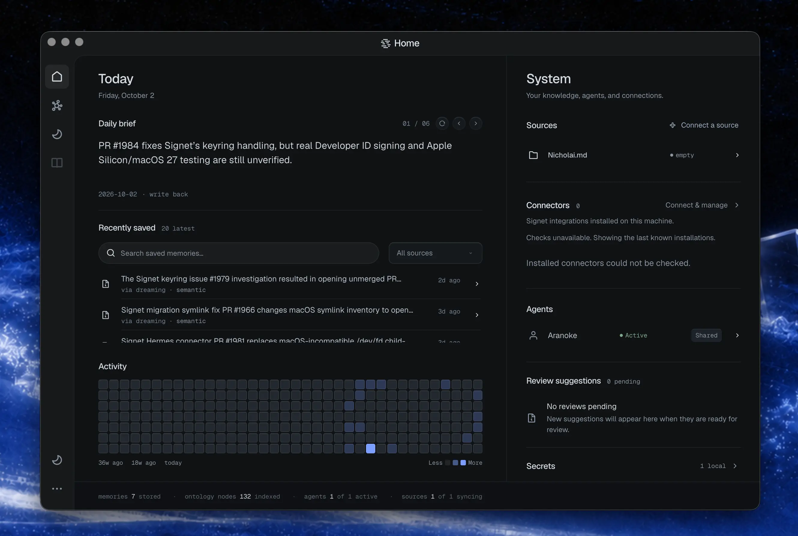

<!-- readme-sync source=README.md blob=b536a907a7fa5c3940a4a56389dda03a13460096 Generated from README.md by scripts/sync-readme-translations.ts. Manual fixes are kept on later syncs. -->
<div align="center">

<a href="https://signetai.sh/"></a>

Signet gibt deinen KI-Agenten ein gemeinsames Gedächtnis. Damit speicherst, synchronisierst und teilst du Erinnerungen, System-Prompts, Transkripte, Organisationswissen und Secrets über alle KI-Tools und -Modelle hinweg, die du nutzt.

<a href="https://github.com/Signet-AI/signetai/releases"></a>
<a href="https://www.npmjs.com/package/signetai"></a>
<a href="LICENSE"></a>
<a href="https://docs.signetai.sh/benchmarking/#current-longmemeval-score"></a>

[Schnellstart](#schnellstart) · [Wie es funktioniert](#wie-es-funktioniert) · [Harnesses](#harnesses) · [Dokumentation](https://docs.signetai.sh/quickstart/) · [Discord](https://discord.gg/Psdeg7sQm7)

[English](README.md) · [Deutsch](README.de.md) · [한국어](README.ko.md) · [简体中文](README.zh-CN.md) · [日本語](README.ja.md)

<sub>Diese Übersetzung wurde automatisch erstellt. Bei Abweichungen gilt die [englische Version](README.md).</sub>

</div>

---

Signet erstellt Erinnerungen automatisch aus deinen Transkripten, importierten Dateien und anderen Quellen. Im Hintergrund baut und pflegt ein Prozess namens „Dreaming“ eine strukturierte Karte der Personen, Projekte, Fakten und Beziehungen in deinem Verlauf. Jede Verknüpfung verweist auf ihre Quelle zurück, sodass du nachvollziehen kannst, woher sie stammt.

Wenn du Modelle oder Agent-Tools wechselst, nimmt Signet deinen Kontext mit. Dein Agent bekommt das Relevante, bevor der nächste Prompt beginnt, und kann eine Erinnerung bei Bedarf bis zur Rohquelle zurückverfolgen, wenn er mehr Details braucht. Du kannst Signet auf deinem eigenen Rechner betreiben oder als Server für dein Team.

## Schnellstart

Wähle eine Installationsmethode. Alle installieren dieselbe kompilierte Signet-Binary; die npm- und Bun-Pakete laden sie nur über ein passendes natives Paket herunter.

```bash
# macOS and Linux
curl -fsSL https://signetai.sh/install.sh | bash

# npm or Bun (Windows, macOS, Linux)
npm install -g signetai
bun add -g signetai
```

Unter Windows x64 führe das in PowerShell aus und öffne anschließend ein neues Fenster, damit der aktualisierte `PATH` greift:

```powershell
iwr -useb https://signetai.sh/install.ps1 | iex
```

Richte dann einen Workspace ein:

```bash
signet setup       # prepare a workspace and open guided onboarding
signet status      # confirm the daemon and Dreaming are healthy
signet dashboard   # browse memory, sources, and settings
```

Das geführte Onboarding begleitet dich durch die Auswahl eines Providers und die Anbindung deiner Quellen und Agenten. Auf einem Headless-System – oder wenn du die Einrichtung lieber von einem Agenten erledigen lässt – kannst du das Setup auch nicht-interaktiv ausführen, indem du Folgendes an deinen Agenten weitergibst:

```
Install and fully configure Signet AI by following this guide exactly: https://signetai.sh/skill.md
```

Unterstützte Plattformen: Linux x64/arm64, macOS x64/arm64, Windows x64 und Docker. Details findest du im [Installationshandbuch](https://docs.signetai.sh/getting-started/install/) und im [Upgrade-Handbuch](https://docs.signetai.sh/upgrading/) für bestehende Installationen.

> Den `stable`-Kanal empfehlen wir für den täglichen Einsatz. `nightly`-Builds (`install.sh | bash -s -- --nightly`) enthalten unveröffentlichte Änderungen und können kaputtgehen.

## Wie es funktioniert

<a href="https://signetai.sh/"></a>

Deine **Quellen** bringen den Kontext, den du bereits hast, in Signet. Verbundene Quellen bleiben bei Änderungen synchronisiert; Dateien und Webseiten kannst du zusätzlich als Einmalimport aufnehmen (siehe [Unterstützte Quellen und Formate](#unterstützte-quellen-und-formate)). Bei importierten Agent-Unterhaltungen wird festgehalten, wer was wann gesagt hat und woher es stammt; unterbrochene Importe werden fortgesetzt, bei erneutem Import entstehen keine doppelten Belege, und Unterhaltungen lassen sich als strukturiertes JSONL wieder exportieren.

**Dreaming** pflegt das Wissen von Signet, während deine Arbeit voranschreitet. Es liest neue Belege zusammen mit deinem bestehenden Kontext, verknüpft die darin beschriebenen Personen, Projekte, Fakten und Beziehungen, geht Widersprüchen erneut nach und schlägt Aktualisierungen für Aussagen vor. Änderungen werden validiert und mit Quellenangaben festgehalten; die ursprünglichen Belege werden nie umgeschrieben. Zeitkritische Aussagen – etwa eine Frist oder die aktuelle Rolle einer Person – können ein Prüfdatum erhalten, damit sie rechtzeitig erneut betrachtet werden, bevor sie veralten. Wie Dreaming arbeitet, kannst du im Dashboard über Live-Traces und ein Operations-Protokoll verfolgen.

Mehr dazu: [Quellen](https://docs.signetai.sh/sources/) · [Datenportabilität](https://docs.signetai.sh/cli/data-portability/) · [Dreaming](https://docs.signetai.sh/pipeline/extraction-decisions/) · [Wissensgraph](https://docs.signetai.sh/knowledge-graph/) · [Architektur](https://docs.signetai.sh/architecture/)

### Unterstützte Quellen und Formate

|Quelle|Hinweise|
|---|---|
|Obsidian|Echtzeit-Dateiwatcher. Mehrere Vaults können schreibgeschützt verbunden werden; unterstützt das LLM-Wiki-Format.|
|GitHub|Echtzeit-Ingest von Issues, Pull Requests und Discussions.|
|Notion|Synchronisiert die Seiten und Datenbankeinträge, die mit einer Notion-Integration geteilt werden; erneute Synchronisierungen rufen nur die Änderungen ab.|
|Discord|Echtzeit-Crawler, der zum Gedächtnis beiträgt und in den bestehenden Wissensgraph einbindet.|
|Webseiten|Einmaliger Import einer öffentlichen URL, extrahiert zu lesbarem Markdown mit Seiten-Metadaten.|
|Slack, E-Mail, Telegram, WhatsApp|_Kommt bald_|

|Format|Erweiterungen|
|---|---|
|Word|`.doc`, `.docx`, `.docm`|
|PowerPoint|`.ppt`, `.pps`, `.pot`, `.pptx`, `.pptm`, `.ppsx`, `.ppsm`|
|Excel|`.xls`, `.xlsx`, `.xlsm`, `.xlsb`|
|OpenDocument|`.odt`, `.ods`, `.odp`|
|Rich Text Format|`.rtf`|
|EPUB|`.epub`|
|CSV|`.csv`|
|PDF|`.pdf`|

## Harnesses

Ein „Harness“ ist die App oder Umgebung, in der dein Agent läuft. Signet verbindet sich über die eigenen Hooks, Plugins oder Erweiterungen des jeweiligen Harness, um im Hintergrund Gedächtnis bereitzustellen und neuen Kontext während deiner Arbeit aufzunehmen – so musst du beim Wechsel des Agenten nicht von vorn anfangen.

|Harness|Integration|
|---|---|
|[Claude Code](https://docs.anthropic.com/en/docs/claude-code)|Hooks + MCP|
|[Codex](https://github.com/openai/codex) und ChatGPT Desktop|Natives Plugin, Hooks/MCP-Fallback|
|[OpenCode](https://github.com/sst/opencode)|Plugin|
|[OpenClaw](https://github.com/openclaw/openclaw)|Plugin|
|[Hermes Agent](https://github.com/NousResearch/hermes-agent)|Memory-Provider-Plugin|
|[Kimi Code](https://github.com/MoonshotAI/kimi-cli)|Hooks + MCP, ACPX-Inferenz|
|[Pi](https://github.com/mariozechner/pi-coding-agent)|Erweiterung|
|Oh My Pi|Erweiterung|
|[Gemini CLI](https://github.com/google-gemini/gemini-cli)|MCP + GEMINI.md-Sync|
|[ForgeCode](https://forgecode.dev/)|Hooks + MCP|
|[Muse Code](https://dev.meta.ai/docs/muse-code)|Hooks + MCP|

Agenten können sich darüber hinaus über Signet Nachrichten schicken. Nachrichten überstehen Neustarts und kommen zu Beginn der nächsten Sitzung bzw. des nächsten Prompts des Empfängers an.

Dein Harness fehlt? [Öffne ein Issue](https://github.com/Signet-AI/signetai/issues). Zur Einrichtung findest du die [Harness-Anleitungen](https://docs.signetai.sh/harnesses/).

## Dashboard und Desktop



Im Dashboard durchsuchst du dein Gedächtnis, verbindest Quellen und Agenten, passt Einstellungen an und siehst Signet bei der Arbeit zu. Es enthält einen Gedächtnisgraphen mit den Personen, Projekten und Aussagen, die Signet kennt, sowie einen Chat, in dem du deinem Gedächtnis mit jedem verbundenen Modell Fragen stellen kannst. Antworten zitieren die Erinnerungen, auf die sie zurückgreifen.

Es läuft im Browser über `signet dashboard` oder als Desktop-App unter macOS, Linux und Windows x64:

```bash
signet desktop install
```

## Gedächtnis prüfen und vertrauen

- **Herkunft:** Wenn du eine Erinnerung abrufst, zeigt Signet, woher sie stammt, wie sie sich verändert hat und ob sie geprüft wurde.
- **Aussagen-Traces:** Du kannst nachfragen, warum Signet etwas glaubt, und erhältst den Verlauf, konkurrierende Aussagen und die exakten Quellenpassagen – über die CLI, die API oder MCP.
- **Agent-Isolation:** Jeder Agent sieht nur das Gedächtnis, das er lesen darf.
- **Secrets:** Secrets werden verschlüsselt gespeichert, mit dem Masterschlüssel im Keyring deines Betriebssystems. Systeme ohne Keyring weichen auf verschlüsselte Dateispeicherung aus und zeigen eine Warnung zum Systemzustand an. Nimm deinen Schlüsselbund unbedingt in deinen Wiederherstellungsplan auf; siehe [Secrets](https://docs.signetai.sh/secrets/).
- **Recovery:** Der Schutzstatus zeigt, ob ein Backup als wiederherstellbar verifiziert wurde, und markiert Backups, die fehlen oder veraltet sind.
- **Schädliche Inhalte:** Inhalte, die auf bekannte feindliche Muster passen, bleiben deinen Agenten verborgen.

## Telemetrie

Signet sendet anonyme Nutzungsdaten: Installations- und Versionszahlen, Feature-Nutzung, Token- und Kostensummen pro Provider sowie bereinigte Crash-Berichte. Gedächtnisinhalte, Prompts, Suchanfragen oder alles, was dich identifizieren könnte, werden nie übertragen. Jedes Ereignis wird zusätzlich in ein lokales Log in deinem Workspace geschrieben, sodass du genau nachlesen kannst, was gesendet wurde.

Zum Deaktivieren setze `telemetryEnabled: false` in deiner Konfiguration oder `SIGNET_TELEMETRY_OPTOUT=1` in deiner Umgebung. Siehe [Telemetrie-Einstellungen](https://docs.signetai.sh/analytics/).

## Benchmarks

Der jüngste getrackte MemoryBench-Lauf von Signet erreicht im Schnitt **97,6 % LongMemEval-Antwortgenauigkeit**. Ein lokales Gedächtnis sollte nicht bedeuten, dass du bei schwachem Abruf Abstriche machen musst. Die Methodik, Anmerkungen zum Scoring und den Ablauf der Läufe findest du unter [Benchmarks](https://docs.signetai.sh/benchmarking/#current-longmemeval-score).

## Dokumentation

[Quickstart](https://docs.signetai.sh/quickstart/) · [CLI](https://docs.signetai.sh/cli/) · [Konfiguration](https://docs.signetai.sh/configuration/) · [Dashboard](https://docs.signetai.sh/dashboard/) · [Harnesses](https://docs.signetai.sh/harnesses/) · [Hooks](https://docs.signetai.sh/hooks/) · [Skills](https://docs.signetai.sh/skills/) · [Secrets](https://docs.signetai.sh/secrets/) · [Auth](https://docs.signetai.sh/auth/) · [SDK](https://docs.signetai.sh/sdk/) · [API](https://docs.signetai.sh/api/) · [Telemetrie](https://docs.signetai.sh/analytics/) · [Workspace v2](https://docs.signetai.sh/workspace-v2/) · [Roadmap](ROADMAP.md) · [Repository-Übersicht](repo.map.yaml)

## Entwicklung

```bash
git clone https://github.com/Signet-AI/signetai.git
cd signetai

bun install
bun run build
bun test
bun run lint
```

```bash
cd platform/daemon && bun run dev     # Daemon dev (watch mode)
cd surfaces/dashboard && bun run dev  # Dashboard dev
```

Für die Entwicklung dieses Repositorys brauchst du:

- Bun für die normale Repository-Entwicklung
- Node.js 18+ für Node-basierte Paket-Surfaces
- Bun im `PATH` des Prozesses, damit Node-Runtimes unter macOS lokal auf Secrets zugreifen können; die kompilierte Signet-Binary und die Desktop-App bringen ihre Helper-Runtime bereits mit
- macOS oder Linux
- Optional für Harness-Integrationen: einer der oben aufgeführten Harnesses

## Mitwirken

Wenn du neu bei Open Source bist, starte mit [Deinem ersten PR](https://docs.signetai.sh/first-pr/). Für Code-Konventionen und die Projektstruktur siehe [CONTRIBUTING.md](CONTRIBUTING.md). Öffne ein Issue, bevor du wesentliche Features beiträgst, und lies dir die [KI-Richtlinien](AI_POLICY.md) durch, bevor du KI-unterstützte Beiträge einreichst.

## Star History

<a href="https://star-history.com/#Signet-AI/signetai&Date">
  <picture>
    <source media="(prefers-color-scheme: dark)" srcset="https://api.star-history.com/svg?repos=Signet-AI/signetai&type=Date&theme=dark" />
    <source media="(prefers-color-scheme: light)" srcset="https://api.star-history.com/svg?repos=Signet-AI/signetai&type=Date" />
    
  </picture>
</a>

## Mitwirkende

Mit Liebe gemacht von...

<a href="https://github.com/NicholaiVogel"></a> <a href="https://github.com/aaf2tbz"></a> <a href="https://github.com/Ostico"></a> <a href="https://github.com/BusyBee3333"></a> <a href="https://github.com/stephenwoska2-cpu"></a> <a href="https://github.com/PatchyToes"></a> <a href="https://github.com/ddasgupta4"></a> <a href="https://github.com/LeuciRemi"></a> <a href="https://github.com/nyashkn"></a> <a href="https://github.com/Alexi5000"></a> <a href="https://github.com/dragontvstaff"></a> <a href="https://github.com/maximhar"></a> <a href="https://github.com/alcar2364"></a> <a href="https://github.com/noamsiegel"></a> <a href="https://github.com/lost-orchard"></a> <a href="https://github.com/gpzack"></a> <a href="https://github.com/Jarvis-ORC-HPS"></a> <a href="https://github.com/nanookclaw"></a> <a href="https://github.com/quannon"></a> <a href="https://github.com/arnavgoel17"></a> <a href="https://github.com/glen-tl"></a> <a href="https://github.com/mikemikimike"></a>
<br clear="left" />

## Lizenz

Apache-2.0.

---

[signetai.sh](https://signetai.sh) ·
[Dokumentation](https://docs.signetai.sh) ·
[Spezifikation](https://signetai.sh/spec) ·
[Diskussionen](https://github.com/Signet-AI/signetai/discussions) ·
[Issues](https://github.com/Signet-AI/signetai/issues)
