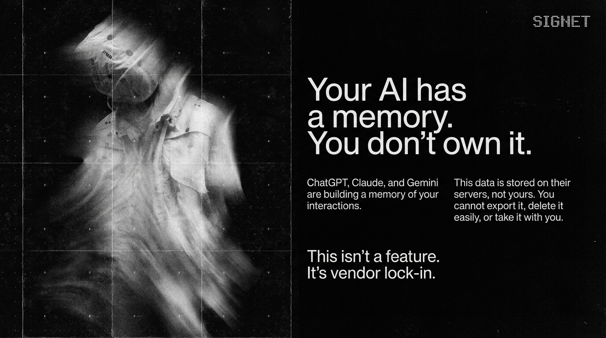
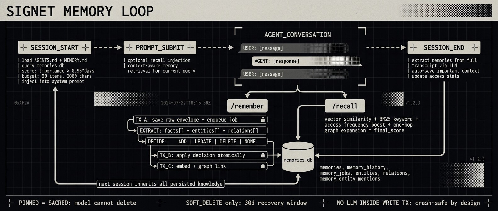

# Signet

[](https://opensource.org/licenses/Apache-2.0)
[](https://signetai.sh/spec)
[](https://github.com/signetai/signetai/stargazers)

<p align="center">
  
</p>

**Own your agent. Bring it anywhere.**

Signet is a local-first identity and memory layer for AI agents.
It keeps your agent instructions, personality, and long-term memory in plain
files under `~/.agents/`, then syncs that identity across your tools.

Today, Signet integrates deeply with Claude Code, OpenCode, and OpenClaw, with
additional harness support in progress.

```text
~/.agents/
├── agent.yaml        # Manifest + runtime config
├── AGENTS.md         # Source-of-truth operating instructions
├── SOUL.md           # Voice/personality guidance
├── IDENTITY.md       # Structured identity metadata
├── USER.md           # User preferences/profile
├── MEMORY.md         # Synthesized working memory
├── memory/           # SQLite DB + embedding artifacts
├── skills/           # Installed skills (SKILL.md)
├── .secrets/         # Encrypted secret store
└── .daemon/          # PID + logs
```

<p align="center">
  
</p>

## Why Signet

Most AI tools build memory silos. If you switch harnesses, you often lose your
agent context or have to rebuild it manually.

Signet gives you one portable memory and identity substrate that you control:

- plain-text identity files you can inspect, version, and move
- a daemon API for memory/search/skills/secrets/hooks
- connector packages that keep harness configs in sync
- hybrid search (semantic + keyword) for consistent recall

## What ships now

- **Portable identity**: sync `~/.agents/AGENTS.md` to harness-specific files
- **Persistent memory**: `signet remember` and `signet recall` backed by SQLite
- **Hybrid retrieval**: vector similarity + FTS5 keyword blending
- **Dashboard** (`http://localhost:3850`): config editor, memory browser,
  embeddings view, skills/secrets/logs
- **Hooks API**: session-start, user-prompt-submit, session-end, compaction,
  synthesis
- **Secrets**: libsodium-encrypted storage and redacted command execution
- **Skills**: install and manage skills from skills.sh
- **Git-aware workflow**: optional auto-commit and sync controls for `~/.agents`

## Requirements

- Node.js 18+ for CLI/package workflows
- Bun for daemon runtime (`signet start`, `signet daemon start`)
- macOS or Linux recommended for the smoothest setup experience

## Quickstart

### 1) Install

```bash
# one-line installer
curl -sL https://signetai.sh/install | bash

# or global package install
npm install -g signetai
# bun add -g signetai

# or run without global install
npx signetai setup
# bunx signetai setup
```

### 2) Run setup

```bash
signet setup
```

The setup wizard initializes `~/.agents/`, configures selected harnesses,
prompts for embeddings (Ollama/OpenAI/skip), creates the memory DB, and starts
the daemon.

### 3) Use it

```bash
signet status
signet dashboard

signet remember "nicholai prefers bun over npm" -w claude-code
signet recall "coding preferences"
```

In connected harnesses, use built-in skills directly:

```text
/remember critical: never commit secrets to git
/recall release process
```

## Harness support

| Harness | Status | Integration |
|---|---|---|
| Claude Code | Supported | Connector writes `~/.claude/CLAUDE.md` + hook config |
| OpenCode | Supported | Connector writes `~/.config/opencode/AGENTS.md` + plugin |
| OpenClaw | Supported | Connector bootstrap + `@signet/adapter-openclaw` runtime plugin |
| Cursor | Planned | File-based identity sync |
| Windsurf | Planned | File/plugin integration |

## Architecture at a glance

<p align="center">
  
</p>

```text
CLI (signet)
  -> setup, status, memory, secrets, skills, hooks, updates, git sync

Daemon (@signet/daemon, localhost:3850)
  -> /api/config, /api/memory/*, /api/hooks/*, /api/skills/*,
     /api/secrets/*, /api/harnesses, /api/logs, /api/update/*
  -> file watcher (identity sync + optional git auto-commit)
  -> static dashboard hosting

Core (@signet/core)
  -> manifest/types, SQLite, hybrid search, identity + skills utilities

Connectors/adapters
  -> claude-code, opencode, openclaw connector packages
  -> openclaw runtime adapter package
```

## Security and privacy model

- Local-first by default: daemon binds to `localhost`
- No telemetry required for core functionality
- Secrets encrypted at rest (`XSalsa20-Poly1305` via libsodium)
- Secret values are never returned by API; subprocess output is redacted

## Roadmap (active plans)

The docs in `docs/wip/` capture current implementation tracks:

- **Memory Pipeline v2** (`docs/wip/memory-pipeline-plan.md`): durable async
  jobs, explicit modify/forget APIs, audit history, stronger safety invariants,
  and improved retrieval quality targets
- **Multi-agent support** (`docs/wip/multi-agent-support.md`): shared daemon,
  scoped memory per agent, OpenClaw roster integration, and agent-focused UI

## Packages

| Package | Role |
|---|---|
| [`@signet/core`](./packages/core) | Types, identity, SQLite, search, shared utilities |
| [`@signet/cli`](./packages/cli) | CLI entrypoint + setup/config workflows |
| [`@signet/daemon`](./packages/daemon) | API server, watcher, sync, dashboard host |
| [`@signet/sdk`](./packages/sdk) | App integration SDK |
| [`@signet/connector-base`](./packages/connector-base) | Shared connector primitives |
| [`@signet/connector-claude-code`](./packages/connector-claude-code) | Claude Code integration |
| [`@signet/connector-opencode`](./packages/connector-opencode) | OpenCode integration |
| [`@signet/connector-openclaw`](./packages/connector-openclaw) | OpenClaw bootstrap integration |
| [`@signet/adapter-openclaw`](./packages/adapters/openclaw) | OpenClaw runtime plugin |
| [`signetai`](./packages/signetai) | Publishable meta-package (`signet` binary) |

## Documentation

- [Quickstart](./docs/QUICKSTART.md)
- [CLI Reference](./docs/CLI.md)
- [Configuration](./docs/CONFIGURATION.md)
- [Memory](./docs/MEMORY.md)
- [Hooks](./docs/HOOKS.md)
- [Harnesses](./docs/HARNESSES.md)
- [Secrets](./docs/SECRETS.md)
- [Skills](./docs/SKILLS.md)
- [Dashboard](./docs/DASHBOARD.md)
- [API Reference](./docs/API.md)
- [Architecture](./docs/ARCHITECTURE.md)

## Development

```bash
git clone https://github.com/signetai/signetai.git
cd signetai

bun install
bun run build
bun test
bun run lint
```

Useful package-level flows:

```bash
# CLI dev
cd packages/cli && bun run dev

# Dashboard dev
cd packages/cli/dashboard && bun run dev

# Daemon dev
cd packages/daemon && bun run dev
```

## Contributing

Contributions are welcome. See [`CONTRIBUTING.md`](./CONTRIBUTING.md).

If you are adding a harness integration, prefer the existing connector pattern
(`@signet/connector-base`) and keep runtime memory semantics in the daemon API.

## License

Apache-2.0.

## Links

- Website: [signetai.sh](https://signetai.sh)
- Docs: [signetai.sh/docs](https://signetai.sh/docs)
- Spec: [signetai.sh/spec](https://signetai.sh/spec)
- Issues: [github.com/signetai/signetai/issues](https://github.com/signetai/signetai/issues)
