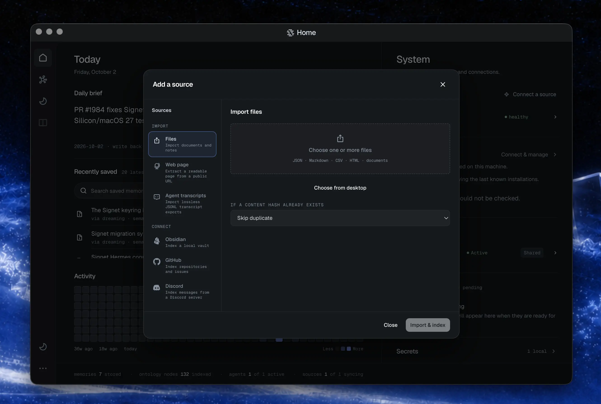
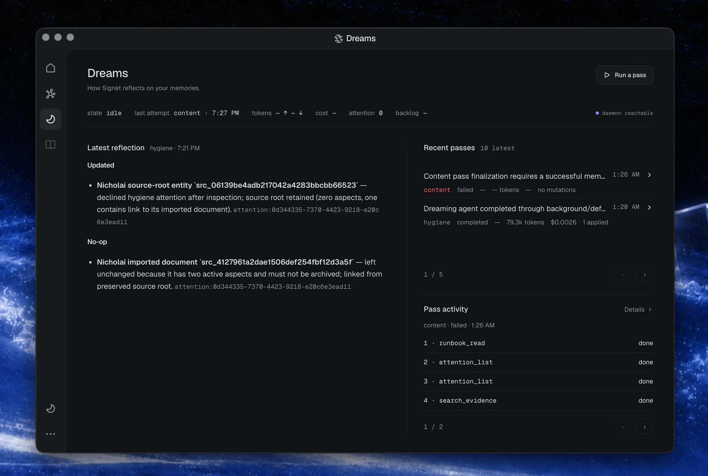
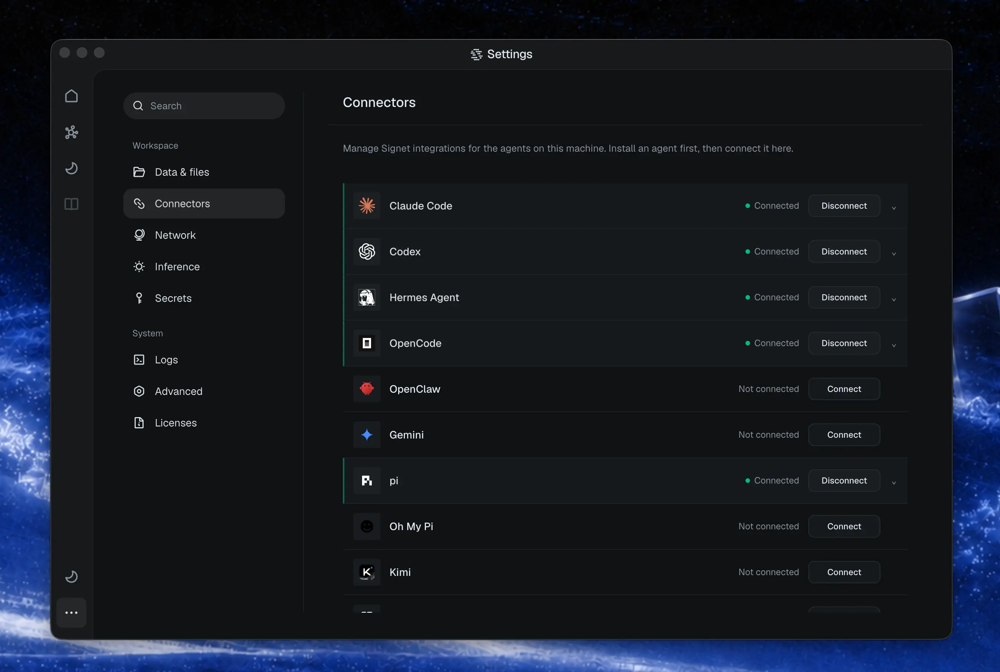
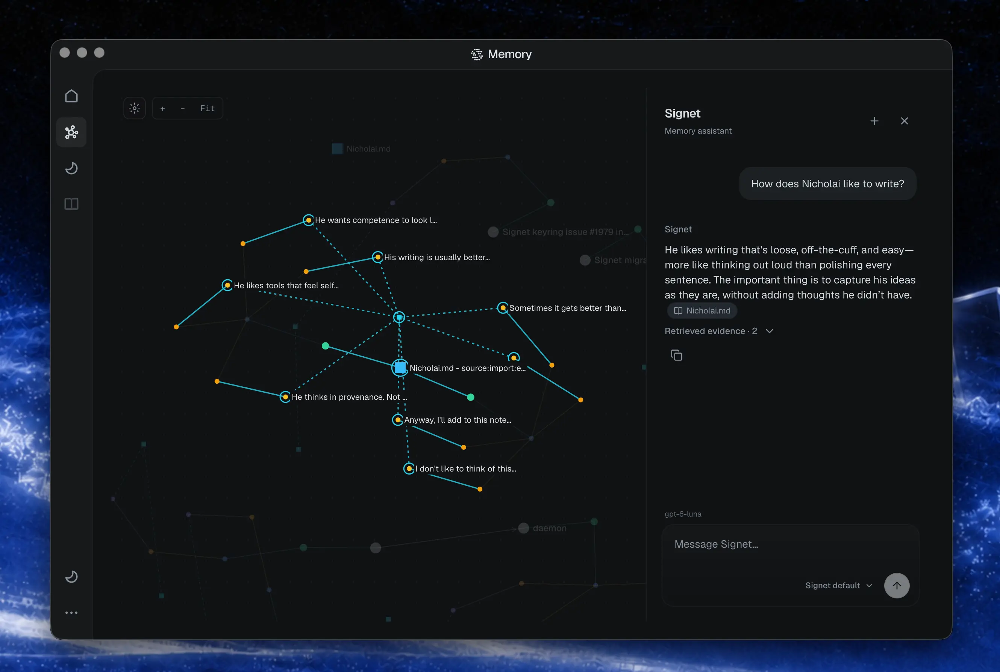
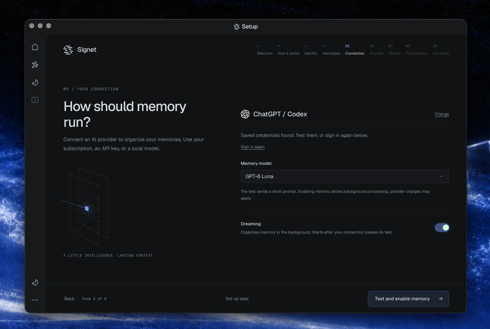
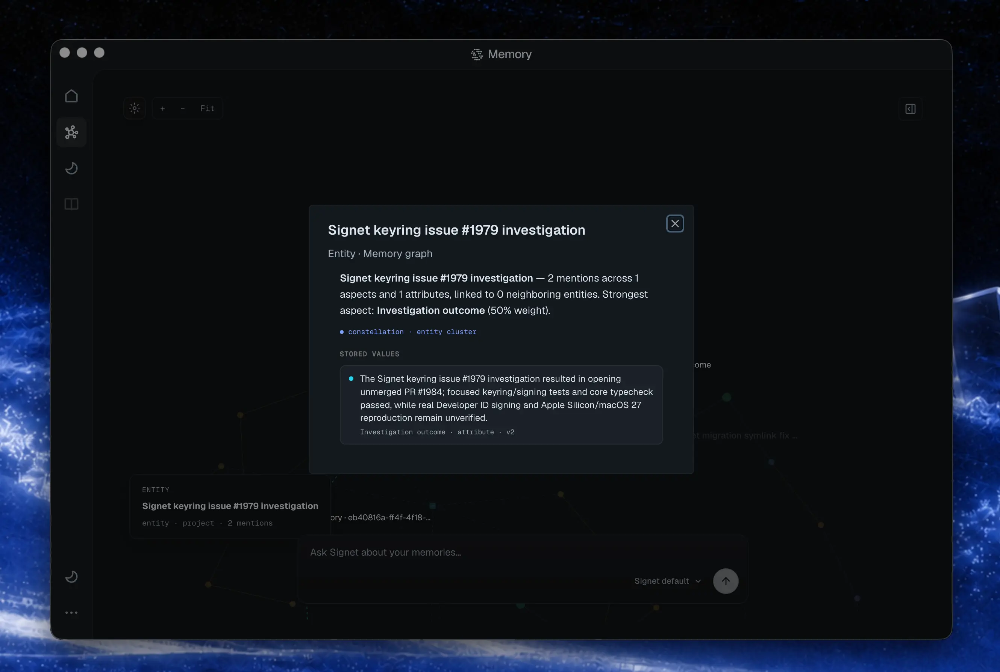
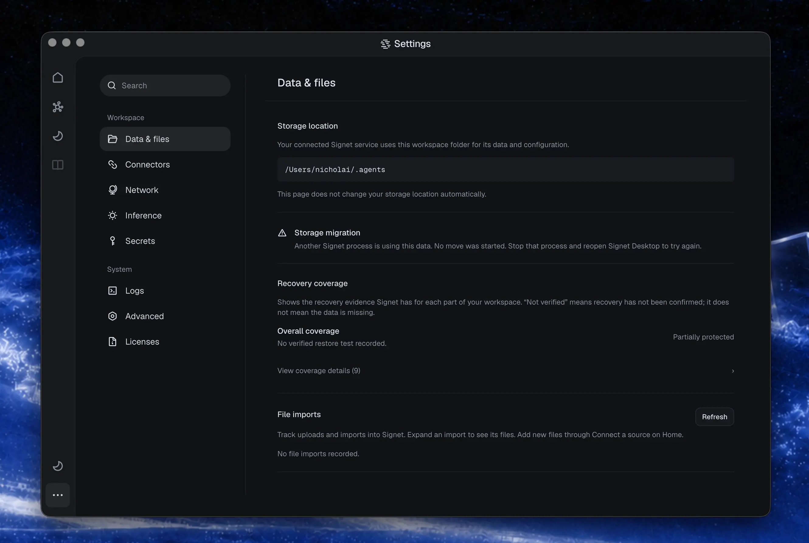

Signet is 1.0.

Today `v1.0.0` goes out on the stable release channel, carrying more than two thousand commits since our last stable release.

When we started on Signet almost eight months ago, we mostly imagined a memory server that organizations would deploy and share. In practice, most of the people actually using it are individual developers and other AI power users. That’s been helpful for clarifying what we want Signet to be: memory that you can run yourself, understand, and keep using as the rest of your tooling changes.

You might code with one model, do research with another, and switch between agent tools depending on the job. In each case you’d like the context you’ve accumulated to remain useful. Signet should give you that continuity, while letting you see clearly what it remembers and how that’s changing over time.

That’s the direction we’re trying to push with this release: making it easy to get that experience, whether you’re running Signet on your laptop or hosting it for an organization. You should be able to use it like any other app, inspect your memory in the dashboard, and grow into a larger deployment when that’s what you want.

The biggest changes in this release are about making Signet easier to use day to day. That mostly means making memory easier to maintain, inspect, and actually bring into your work:

- Pipeline V2 is now **Dreaming**, a more complete agentic loop for maintaining your memory and ontology.
- We now have official Windows support and a cross-platform desktop experience.
- Setup is guided, and there are new ways to bring conversations and documents into Signet.
- Memory is easier to inspect, with clearer provenance, revision history, and review state.

> **Upgrading an existing workspace?** This release introduces Workspace v2. Updating Signet and migrating your workspace are separate steps; see **Installing and updating** below.

## Sources and Dreaming: bringing your context together


**Sources** are how the context you already have gets into Signet: notes, project documents, Notion pages, agent conversations, and so on. You can connect an Obsidian vault or Notion workspace during onboarding, so your agents start with useful context from your existing work. You can also bring in webpages, PDFs, Office documents, and EPUBs as one-time imports, without setting up an ongoing connection.



Conversation imports preserve who said what, when, and where it came from. They can resume after an interruption, and importing the same conversation again won’t duplicate its evidence. You can also export conversations as structured JSONL for analysis, fine-tuning preparation, or re-import, choosing which agents and dates to include. That context is yours to take with you.

Signet makes all of this material searchable and connects the people, projects, facts, and relationships it describes. That forms a semantic ontology: a shared representation of what your sources are about and how they relate. A project note, an updated Notion page, and an agent conversation can together explain a decision and how it changed, with references back to the supporting material.

**Dreaming** is responsible for maintaining that knowledge as your work evolves. It examines new evidence alongside existing context, consolidates related information, revisits contradictions, and proposes updates to claims. Changes are validated and recorded with citations; the original evidence stays intact. Claims tied to time, like a deadline or someone’s current role, can carry a review date, so Dreaming comes back to them before they go stale. Building on Pipeline V2, Dreaming can work through a body of connected evidence rather than treating each new memory as an isolated extraction job.

You can follow that work in the dashboard through live traces, pass summaries, and an operation ledger. This release also improves recovery from interrupted work and stalled triggers, and prevents duplicate pass creation.



Read more about [connecting and importing sources](https://docs.signetai.sh/sources/), [transcript import and export](https://docs.signetai.sh/cli/data-portability/), and [Dreaming and ontology maintenance](https://docs.signetai.sh/pipeline/extraction-decisions/).

## Your context, across your agents

Sources bring your existing work into Signet. Harness integrations bring that context into the agents you use, and capture new context as you work. (A harness is the app or environment your agent runs in.) Signet connects through a harness’s supported hooks, extensions, and plugins to supply relevant memory in the background, without making you paste the same context into every session.



We maintain integrations for Claude Code, Codex, OpenCode, OpenClaw, Hermes Agent, Pi, Oh My Pi, and Kimi Code. They connect your sessions to a shared memory, so switching between agents can carry forward the decisions, preferences, and project knowledge you’ve already built up. Each integration works with the capabilities of its host, including session context, conversation capture, and on-demand memory tools.

This release expands that support:

- ChatGPT desktop connects through Signet’s native Codex plugin, with discovery and setup on macOS, Windows, and the Linux preview. It supports Work/Codex mode.
- Kimi Code joins the supported harnesses with lifecycle hooks, MCP tools, and support for background inference through ACPX.
- Agents can message each other through Signet, and messages now arrive on their own. A message sent to an agent shows up at the start of its next session or prompt, survives restarts, and stays unread until that agent acknowledges it.
- Hermes’s curated native memory now participates in Signet recall, with provenance. Edits and removals are reflected in recall while the original memory files remain under Hermes’s control.

See the [harness integration guides](https://docs.signetai.sh/harnesses/), including [Codex and ChatGPT desktop](https://docs.signetai.sh/harnesses/codex/), [Kimi Code](https://docs.signetai.sh/harnesses/kimi/), and [Hermes Agent](https://docs.signetai.sh/harnesses/hermes-agent/).

## At home on your desktop


Signet is designed for both server and desktop use. You can run it as a server for yourself or an organization, or use it like any other app on your computer. Install Signet normally, then add the optional desktop app with `signet desktop install`. It’s available on macOS, Linux, and Windows x64.

We’ve redesigned the dashboard around what you actually do there: look through your memory, connect sources and agents, change settings, and watch Signet work. The redesigned dashboard is available in your browser too, giving you the same controls whichever way you access it.

The dashboard also has a new memory graph, a 2D map of the people, projects, and claims Signet knows about and how they connect. Next to it is a chat where you can ask questions of your memory using any model you’ve connected. Answers cite the memories they draw on, and conversations pick up where you left off.



Getting started now happens there as well. Guided onboarding walks you through choosing a provider and connecting your sources and agents in the dashboard or desktop app, replacing the old terminal questionnaire. Non-interactive CLI setup remains available for headless installations, or if you’d rather have an agent handle setup for you.



## Other improvements

- Agent isolation: each agent only recalls memory it’s allowed to read.
- Secret storage: the master encryption key now lives in your OS keyring, and secrets stay encrypted on disk. Systems without a keyring fall back to encrypted file storage and show a health warning.
- Status and diagnostics: connector readiness, workspace statistics, queues, and Dreaming state now share a consistent view across the CLI and dashboard. Provider, model, embedding, and inference routes are inspectable in [dashboard settings](https://docs.signetai.sh/dashboard/).
- Workspace v2: a clearer layout separates authored files, durable data, transcripts, runtime state, and caches. Migration preserves source identities and evidence links; skills can use their own Git repository. Updating and migrating remain separate steps, covered below.
- File inbox: manual file drops and dashboard uploads share a durable import path. Files already in the inbox are not automatically imported during setup or migration.
- Recovery visibility: protection status tells you whether a backup has been verified as restorable, and flags backups that are missing or stale. Git sync on its own doesn’t cover your whole workspace.
- Transparent memory: recall shows where each memory came from, how it’s changed, and whether it’s been reviewed.

  
- Content matching known hostile patterns is kept out of what your agents see. You can also ask why Signet believes something: a claim trace returns its history, competing claims, and the exact source passages behind it, from the CLI, API, or MCP.
- Recall and search: fixed scope and filter bugs, fewer duplicate session results, caps on expensive searches, and resumable rebuilds when the full-text index is damaged.
- Dreaming and embedding recovery: fixed stuck triggers and duplicate passes, and improved recovery from interrupted embedding migrations and provider failures.
- Sources and transcripts: improved interrupted-import recovery, serialized conflicting source changes, made deletion resumable, and preserved transcript provenance through migration and backfill.
- Server reliability: continued moving database work behind the database-owner service, with bounded startup, shutdown, and background work, better cancellation, and recovery from service failures. Background work backs off when your machine is busy, and the daemon recovers on its own from crash loops.
- Desktop and packaging: fixed packaged-daemon startup, missing connector assets, Windows shell and path handling, macOS window controls, and managed AppImage updates.
- Documentation: a new docs site at [docs.signetai.sh](https://docs.signetai.sh/) covers setup, harnesses, Dreaming, and the API in one place.

Details are recorded in the [release changelog](https://github.com/Signet-AI/signetai/blob/v1.0.0/CHANGELOG.md).

## Telemetry

This is the first stable release with telemetry, so if you’re upgrading, it’s new to you. Signet now sends anonymous usage data: install and version counts, which features get used, token and cost totals per provider, and sanitized crash reports. It never sends memory content, prompts, search queries, or anything that identifies you. Every event is also written to a local log at `.daemon/telemetry/events.jsonl` in your workspace, so you can read exactly what was sent.

New installs set up through the dashboard start with telemetry off. Existing workspaces upgrading from an earlier stable release have it **on** unless you’ve already set a preference. To turn it off, set `telemetryEnabled: false` in your config or `SIGNET_TELEMETRY_OPTOUT=1` in your environment. Details are in [telemetry controls](https://docs.signetai.sh/analytics/).

## Installing and updating

Choose **one** installation method. The native installers and the npm/Bun packages install the same compiled Signet binary.

### Native installer — macOS and Linux

```bash
curl -fsSL https://signetai.sh/install.sh | bash
```

### Native installer — Windows x64

Run in PowerShell:

```powershell
iwr -useb https://signetai.sh/install.ps1 | iex
```

Open a new PowerShell window after installation so the updated PATH is available.

### npm — Windows, macOS, and Linux

```bash
npm install -g signetai
```

### Bun — Windows, macOS, and Linux

```bash
bun add -g signetai
```

For a new installation, run `signet setup` after installing. See the [installation guide](https://docs.signetai.sh/getting-started/install/) for platform details.

### Update an existing installation

```bash
signet update channel stable
signet update install
```

`signet update channel stable` moves you to the stable track; `signet update install` installs the latest stable release. Follow any restart instructions printed by the updater, then check `signet status`. See [upgrading](https://docs.signetai.sh/upgrading/) for details.

### Migrate an existing workspace

Back up your workspace. Replace the paths below with your current workspace and intended v2 destination:

```bash
signet workspace layout migrate preflight --source "<v1-root>" --destination "<v2-root>"
signet workspace layout migrate run --source "<v1-root>" --destination "<v2-root>"
```

Preflight is read-only. Resolve blockers before migration; interrupted runs can resume from their journal. Rollback is only available before the v2 destination accepts durable writes. Older, layout-unaware binaries must not be pointed at an actively used v2 workspace.

See the [Workspace v2 migration guide](https://docs.signetai.sh/workspace-v2/) for recovery and verification instructions.



**Secret recovery also depends on the keyring.** After secrets migrate to keyring-backed storage, a workspace backup alone is not enough to recover them. Preserve the corresponding platform keychain as part of your recovery plan; see [secret storage and recovery](https://docs.signetai.sh/secrets/).

## Since the previous stable release

Since `v0.157.3`, this release includes **2,136 commits across 2,302 changed files**, with **259,190 lines added** and **183,362 lines removed**.

> Comparison range: `v0.157.3..v1.0.0`  
> Previous stable: `v0.157.3`  
> New stable: `v1.0.0`

Full version-by-version history: [CHANGELOG.md](https://github.com/Signet-AI/signetai/blob/main/CHANGELOG.md).

## Contributors

Thank you to [everyone who has helped build Signet](https://github.com/Signet-AI/signetai/blob/v1.0.0/README.md#contributors):

Nicholai Vogel (@NicholaiVogel), Avery Felts (@aaf2tbz), @Ostico, @BusyBee3333, @stephenwoska2-cpu, @PatchyToes, @ddasgupta4, @LeuciRemi, @nyashkn, @Alexi5000, @dragontvstaff, @maximhar, @alcar2364, @noamsiegel, @lost-orchard, @gpzack, @Jarvis-ORC-HPS, @nanookclaw, @quannon, @arnavgoel17, @glen-tl, and @mikemikimike.

Thank you to everyone who tested the development releases, reported problems, and helped us get here.
